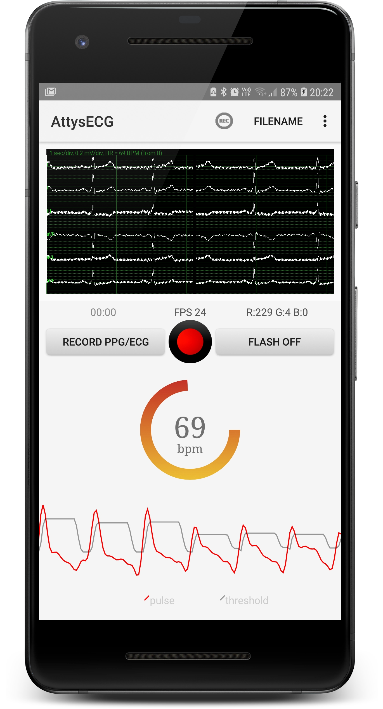
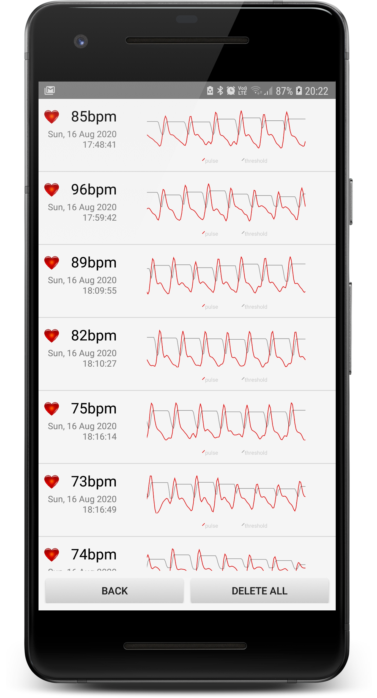

# AttysECG

ECG app for [Attys](http://www.attys.tech)

## Features

* Realtime plot of I,II,III,aVR,aVL,aVF
* Wavelet based heartbeat detection
* Lead off detection
* Heartrate over time with heartrate variability stats
* Heartrate variability animation for biofeedback / breathing exercises
* PQRST inspector: zoom into one PQRST complex and measure precisely the timings
* Vector ECG to assess in detail the electrical heart axis of P,QRS and T
* Save the data in OCTAVE/MATLAB(tm)/PYTHON compatible format
* Long term heartrate logging with epoch timestamp

## Link to Google Play Store

[https://play.google.com/store/apps/details?id=tech.glasgowneuro.attysecg]

## Plot and inspect the recorded ECGs

See also the subdirectory `ecg-plotting` how to use Python
to plot the ECG or simply your web browser.

# This (forked) version adds

PPG heart-rate detection with your device camera, just navigate to menu > ppg analysis

## Features
* Realtime PPG plot of Y[U]V data
* Momentary & Average heart-rate detection
* History of recorded PPG data
* PPG/ECG simultaneous recorder, outputs II, ppg raw, filter and matched data as well as threshold values
* Framerate analyser for performance analysis and option to select 20, 24 or 30Hz sampling rate depending on device performance

  
  

