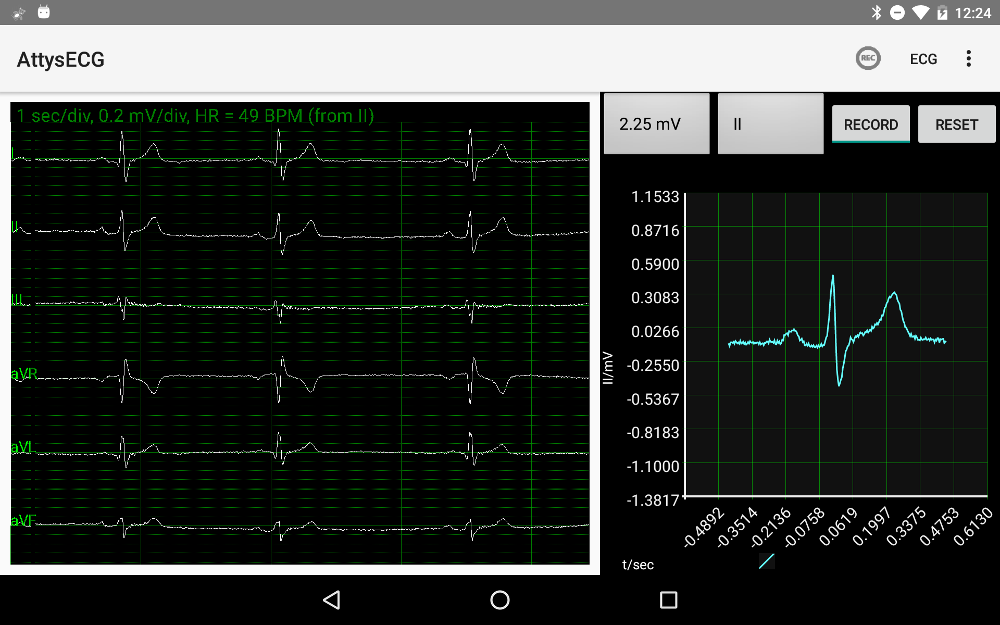
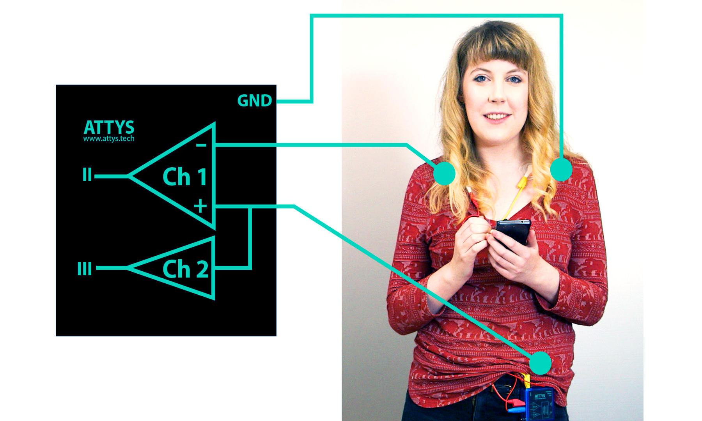
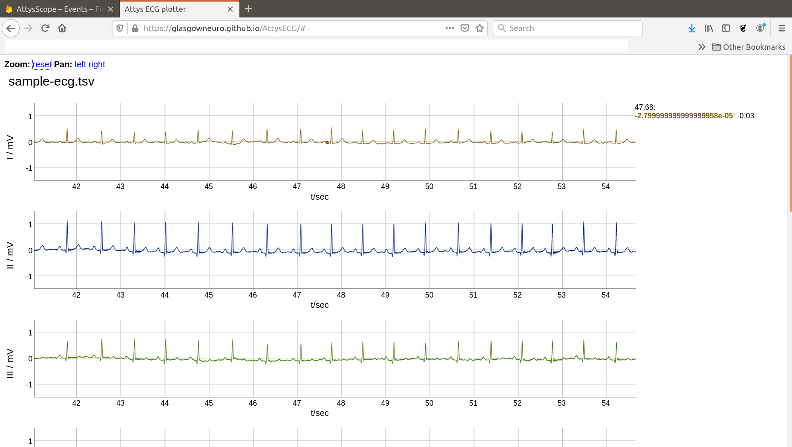

# AttysECG

ECG app for [Attys](http://www.attys.tech)

## Features

* Realtime plot of I,II,III,aVR,aVL,aVF
* Wavelet based heartbeat detection
* Lead off detection
* Heartrate over time with heartrate variability stats
* Heartrate variability animation for biofeedback / breathing exercises
* PQRST inspector: zoom into one PQRST complex and measure precisely the timings
* Vector ECG to assess in detail the electrical heart axis of P,QRS and T
* Save the data in OCTAVE/MATLAB(tm)/PYTHON compatible format
* Long term heartrate logging with epoch timestamp

## Install from Google Play

## Wiring

  * "+" : left foot or hip
  * "-" : right shoulder or wrist
  * GND : left shoulder or wrist

The two amplifiers are interally connected. No need to connect a wire
to the 2nd channel amplifier.

## Plot and inspect the recorded ECGs

Click on the screenshot to enter the ECG viewer.

