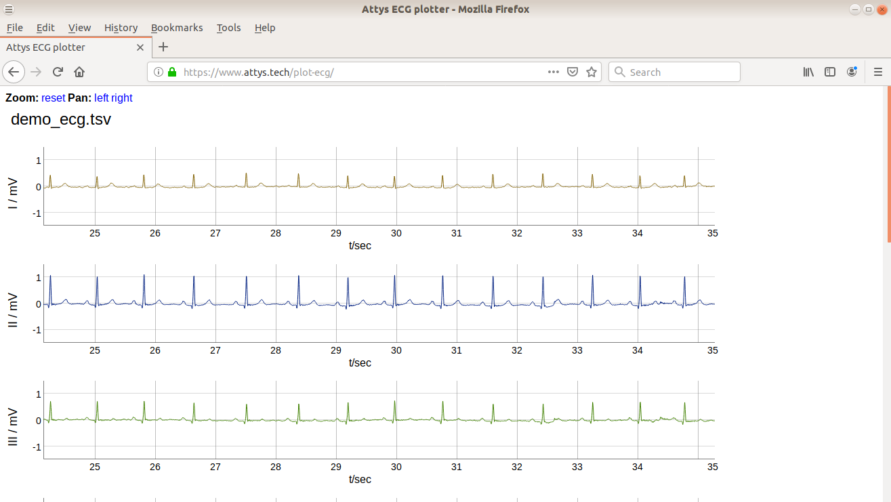

# ECG viewer

Plots ECGs recorded with the Attys (http://www.attys.tech)
using the Dygraphs (http://dygraphs.com)
library and jquery (https://jquery.com/).

For example within the app AttysECG you can share the recorded 
ECG via e-mail and then recipient simply drops the 
ECG file into this ECG viewer.

The ECG viewer allows panning and zooming.

## How to run

  - Copy all files in this directory into a local folder or on a web server.
  - Point your web browser to index.html.
  - Drop a tsv file into the drag/drop zone or browse for the tsv file.

Try it out with the sample ecg provided here on github.

## Online version

An online version is available here: https://www.attys.tech/plot-ecg/

